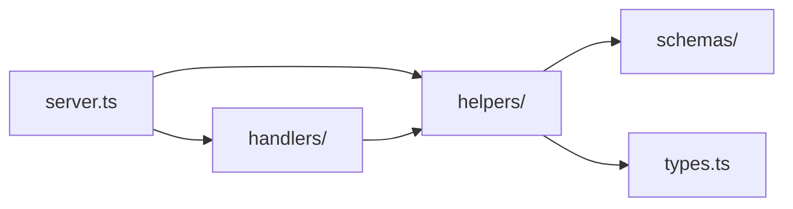

## Context

The cex-broker gRPC service is implemented primarily in [`src/server.ts`](src/server.ts) (~2,306 lines). It already delegates some domains to [`src/helpers/`](src/helpers/)—notably [`order-book.ts`](src/helpers/order-book.ts) and [`order-telemetry.ts`](src/helpers/order-telemetry.ts)—but ~18 helper functions and two large RPC handlers (`ExecuteAction`, `Subscribe`) remain inline. [`src/helpers/index.ts`](src/helpers/index.ts) (~965 lines) holds broker pool, policy, and transfer logic; it is a separate consolidation target and out of scope unless incidentally touched.

Duplicate primitives exist today:

| Primitive | Locations |
|-----------|-----------|
| `isRecord` | `server.ts`, `order-book.ts` |
| `asRecord` (equivalent) | `order-telemetry.ts` |
| `getErrorMessage` | `server.ts`; inlined 6× in `Subscribe` |
| Error → gRPC status | `stableGrpcErrorCode`, `mapCcxtErrorToGrpcStatus` in `server.ts` only |

Tests import `getServer` from `server.ts` and exercise RPC behavior via files such as `test/treasury-discovery-rpc.test.ts` and `test/order-book-rpc.test.ts`. Extractions must preserve those contracts.

## Goals / Non-Goals

**Goals:**

- Define a **canonical folder layout** and dependency rules for all future broker development.
- Shrink `server.ts` to **registration + dispatch + cross-cutting wrappers** (auth, otel callback, logging), targeting **&lt; 400 lines** at completion.
- Extract leaf helpers and domain modules with **unit tests**; keep RPC integration tests green per slice.
- Deduplicate shared primitives in one place (`helpers/shared/`).
- Enable phased handler extraction without a single large-bang refactor.

**Non-Goals:**

- Changing gRPC proto definitions or client-visible JSON contracts.
- Renaming or re-exporting the public package API beyond existing `getServer` usage.
- Splitting `helpers/index.ts` in this change (document as follow-up).
- Introducing a parallel `src/utils/` tree (extend `helpers/` instead).
- Behavior changes to order-book, treasury, deposit, or policy logic.

## Decisions

### 1. Extend `src/helpers/`, do not add `src/utils/`

All shared and domain logic lives under `src/helpers/` with optional subfolders. This matches existing imports in `server.ts` and test layout.

**Alternative considered:** `src/utils/` — rejected to avoid two conventions and import confusion.

### 2. Canonical directory layout

```
src/
  server.ts                 # Thin: grpc load, getServer(), service map, delegates
  handlers/                 # RPC dispatch (phased)
    execute-action/
      index.ts              # Handler registry
      deposit.ts
      withdraw.ts
      orders.ts
      treasury-call.ts
      pass-through.ts
    subscribe/              # Optional phase 4
      index.ts
  helpers/
    shared/                 # Cross-module primitives
      guards.ts             # isRecord, asRecord
      errors.ts             # getErrorMessage, safeLogError
    grpc/                   # Transport-layer helpers
      payload.ts            # parsePayload (Zod)
      status.ts             # stableGrpcErrorCode, mapCcxtErrorToGrpcStatus, resolveGrpcError
    treasury-discovery.ts
    transfer-network.ts
    deposit.ts
    order-book.ts           # existing
    order-telemetry.ts      # existing (+ background emit wrapper)
    constants.ts            # existing
    logger.ts               # existing
    otel.ts                 # existing
    index.ts                # broker pool, policy (unchanged scope)
  schemas/                  # existing Zod payloads
  types.ts                  # existing
```

**Dependency direction (enforced by convention and review):**



- `helpers/**` MUST NOT import from `server.ts` or `handlers/**`.
- `handlers/**` MAY import `helpers/**` and `schemas/**`.
- Prefer **concrete imports** (`helpers/deposit`) over re-exporting everything through `helpers/index.ts`.

### 3. Phased extraction order (low risk → high impact)

| Phase | Deliverable | Risk |
|-------|-------------|------|
| 0 | `helpers/shared/*`; dedupe `order-book`, `order-telemetry`, Subscribe | Lowest |
| 1a | `helpers/grpc/payload.ts`, `status.ts` + unit tests | Low |
| 1b | `treasury-discovery`, `transfer-network`, `deposit`; telemetry wrapper | Low |
| 2 | `resolveGrpcError`, `requireParsedPayload`, broker resolution helpers | Medium |
| 3 | `handlers/execute-action/*` — one action cluster per PR | Medium |
| 4 | Subscribe modularization + shared `getErrorMessage` | Medium |

Each phase is a **separate PR** (~300 lines diff max). Run `bun test` before merge.

**Alternative considered:** Big-bang move of entire `ExecuteAction` switch — rejected due to reviewability and regression risk.

### 4. Handler module contract (Phase 3+)

Handlers receive an explicit context object; no hidden globals:

```ts
export type ExecuteActionContext = {
  call: grpc.ServerUnaryCall<ActionRequest, ActionResponse>;
  wrappedCallback: grpc.sendUnaryData<ActionResponse>;
  action: ActionType;
  policy: PolicyConfig;
  brokers: Record<string, BrokerPoolEntry>;
  metadata: Metadata;
  normalizedCex: string;
  cex: string;
  symbol?: string;
  selectedBrokerAccount?: BrokerAccount;
  broker: Exchange;
  verity: { proof: string };
  applyVerityToBroker: (target: Exchange) => void;
  useVerity: boolean;
  verityProverUrl: string;
  otelMetrics?: OtelMetrics;
};

export type ActionHandler = (ctx: ExecuteActionContext) => Promise<void>;
```

**Dispatch flow:**

```
getServer()
  └─ registers createExecuteActionHandler(deps) on the gRPC service

createExecuteActionHandler (per RPC)
  ├─ auth + otel wrappedCallback
  ├─ build ExecuteActionContext
  ├─ Action.Call → handleOrderBookCall (prelude, may return early)
  ├─ resolve broker + apply Verity
  └─ dispatchExecuteAction(ctx)
        └─ ACTION_HANDLERS[action](ctx)
```

`ACTION_HANDLERS` in `handlers/execute-action/registry.ts` maps each `Action` to a module handler. Order and pass-through actions share cluster routers (`handleOrders`, `handlePassThrough`) registered once per action enum value. New actions add one registry entry and one handler file.

**Alternative considered:** Class-based `ServerService` — rejected; functional handlers match existing style and test fixtures.

### 5. Module mapping from current `server.ts` helpers

| Current helper (approx. lines) | Target module |
|-------------------------------|---------------|
| `parsePayload` | `helpers/grpc/payload.ts` |
| `getErrorMessage`, `safeLogError` | `helpers/shared/errors.ts` |
| `stableGrpcErrorCode`, `mapCcxtErrorToGrpcStatus` | `helpers/grpc/status.ts` |
| `handleTreasuryDiscoveryCall`, `fetchCurrencyMetadata`, `callArgs` | `helpers/treasury-discovery.ts` |
| `resolveTransferNetwork`, `buildTransferNetworkEvidence`, `networkAliasSet` | `helpers/transfer-network.ts` |
| `depositField`, `normalizeDepositStatus`, `depositMatchesTransaction`, `stringAmountEquals`, `normalizeAddress` | `helpers/deposit.ts` |
| `emitOrderExecutionTelemetryInBackground` | `helpers/order-telemetry.ts` |
| `isRecord` | `helpers/shared/guards.ts` |

### 6. Testing strategy

- **Unit tests** for pure modules: `test/shared-guards.test.ts`, `test/grpc-status.test.ts`, `test/deposit-helper.test.ts`.
- **RPC tests** unchanged: continue importing `getServer` from `server.ts`.
- No requirement to mock gRPC for extracted pure functions.

### 7. Guardrails for future development

Document in README or `AGENTS.md` (optional doc touch in implementation):

- New domain logic → new file under `helpers/<domain>.ts` or `handlers/`.
- `server.ts` line budget: aim &lt; 400 lines post-migration.
- Before adding a helper to `server.ts`, grep `src/` for an existing equivalent.
- Optional CI: script fails if `server.ts` exceeds N lines (Phase 5, not blocking Phase 0–3).

## Risks / Trade-offs

| Risk | Mitigation |
|------|------------|
| Circular imports between helpers | Enforce dependency direction; `shared/` has no domain imports |
| `helpers/index.ts` becomes a god barrel | Import concrete modules; do not add server helpers to `index.ts` |
| Handler extraction changes error codes subtly | One action per PR; run full RPC test file for that action |
| Large PR fatigue | Cap diff size; phases 0–2 before any handler move |
| Subscribe infinite loops harder to test | Extract loops but keep behavior identical; rely on existing stream tests |

## Migration Plan

1. Land Phase 0–1 without handler moves — behavior-identical refactor only.
2. Land Phase 2 — internal boilerplate reduction in `server.ts`.
3. Land Phase 3 starting with `Deposit` as the template handler; repeat per action.
4. Land Phase 4 for Subscribe.
5. Validate: `bun test`, `bun run check`, `openspec validate cex-broker-server-modularization --strict`.

**Rollback:** Each phase is independently revertible via git revert; no schema or deployment migrations.

## Open Questions

- Whether to add a CI line-count check on `server.ts` in this change or a follow-up.
- Whether `handlers/` should live under `src/server/handlers/` for colocation — default is `src/handlers/` for top-level visibility.
- Timing of `helpers/index.ts` split into `broker-pool.ts` + `policy.ts` (separate OpenSpec change recommended).